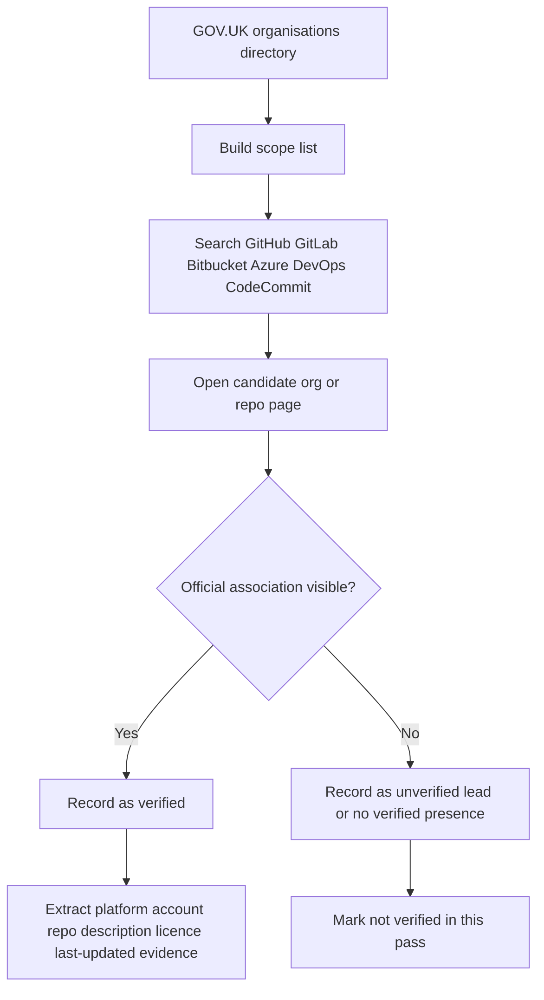

# UK Government Departments and Public Source-Code Repositories

## Executive summary

This report maps UK central government ministerial departments and major executive agencies to verifiable public source-code presences on major source-code management platforms, using primary sources first: GOV.UK organisation pages, official service sites, and SCM metadata on the account or repository itself. The authoritative baseline for scope is the GOV.UK “Departments, agencies and public bodies” directory, which lists 24 ministerial departments and classifies executive agencies under their parent departments. citeturn2view0turn10search0

The strongest finding is that the verified public footprint is overwhelmingly concentrated on GitHub. In this research pass, I found high-confidence, officially-associated public GitHub presences for DSIT (via Government Digital Service and the Met Office), DBT and Companies House, DfE, Defra, DfT (including DVSA and a department-owned public repository), the Home Office, the Ministry of Justice and HMCTS, the Ministry of Defence via Dstl, and MHCLG via the Planning Inspectorate. I did **not** find equivalently verified public GitLab, Bitbucket, Azure DevOps or AWS CodeCommit presences for UK ministerial departments or major executive agencies in the time-bounded evidence set I assembled here. Azure DevOps is deprecating public projects, and AWS CodeCommit requires credentials and is not anonymously browsable in the same way as GitHub/GitLab/Bitbucket, which materially affects discoverability. citeturn40search6turn40search2turn41search4turn40search3turn42search4turn42search0

A second important finding is that the largest UK government open-source estates are hosted at the **account/organisation** level rather than as one-off repositories. That is especially true for `alphagov`, `ministryofjustice`, `UKHomeOffice`, `DEFRA`, `dfe-digital`, `uktrade`, `dvsa`, `companieshouse`, `MetOffice`, and, outside the minimum scope but still material, `hmrc`. For those large estates, the most reliable “comprehensive mapping” is therefore the verified official account plus representative public repositories visible on the account page at the time indexed by the search tool, rather than a repo-by-repo export of every public repository. citeturn11search0turn16view0turn37view0turn35view0turn13search0turn21search0turn21search1turn12search1turn25view0turn12search0

## Scope and authoritative inventory

For the mandatory scope, I use the GOV.UK organisations directory as the authoritative source for ministerial departments, and I include the major executive agencies that GOV.UK classifies under those departments. I also note a small number of **supplementary non-ministerial departments** with very clear public GitHub presences because they are materially relevant to anyone building a full UK-government SCM map. citeturn2view0turn10search0

### Ministerial departments in scope

GOV.UK lists 24 ministerial departments. citeturn2view0

| Ministerial department | Public SCM status in this pass |
|---|---|
| entity["organization","Attorney General's Office","uk government"] | No verified public SCM presence located |
| entity["organization","Cabinet Office","uk government"] | No department-level presence verified; DSIT-hosted GDS accounts cover key cross-government digital repos |
| entity["organization","Department for Business and Trade","uk government"] | Verified GitHub presence located |
| entity["organization","Department for Culture, Media and Sport","uk government"] | No verified public SCM presence located |
| entity["organization","Department for Education","uk government"] | Verified GitHub presence located |
| entity["organization","Department for Energy Security and Net Zero","uk government"] | No verified public SCM presence located |
| entity["organization","Department for Environment, Food & Rural Affairs","uk government"] | Verified GitHub presence located |
| entity["organization","Department for Science, Innovation & Technology","uk government"] | Verified GitHub presence located |
| entity["organization","Department for Transport","uk government"] | Verified GitHub presence located |
| entity["organization","Department for Work and Pensions","uk government"] | No verified public SCM presence located |
| entity["organization","Department of Health and Social Care","uk government"] | No **strictly verified** public SCM presence located |
| entity["organization","Foreign, Commonwealth & Development Office","uk government"] | No verified public SCM presence located |
| entity["organization","HM Treasury","uk government"] | No verified public SCM presence located |
| entity["organization","Home Office","uk government"] | Verified GitHub presence located |
| entity["organization","Ministry of Defence","uk government"] | Verified GitHub presence located |
| entity["organization","Ministry of Housing, Communities & Local Government","uk government"] | Verified GitHub presence located via executive agency |
| entity["organization","Ministry of Justice","uk government"] | Verified GitHub presence located |
| entity["organization","Northern Ireland Office","uk government"] | No verified public SCM presence located |
| entity["organization","Office of the Advocate General for Scotland","uk government"] | No verified public SCM presence located |
| entity["organization","Office of the Leader of the House of Commons","uk government"] | No verified public SCM presence located |
| entity["organization","Office of the Leader of the House of Lords","uk government"] | No verified public SCM presence located |
| entity["organization","Scotland Office","uk government"] | No verified public SCM presence located |
| entity["organization","Wales Office","uk government"] | No verified public SCM presence located |

### Major executive agencies in scope

The GOV.UK organisations directory classifies these as executive agencies under their parent departments; the table below keeps the agencies most material to public-code discovery. “Not verified in this pass” means I did not find a primary-source-backed public SCM presence on the platforms searched; it is **not** proof of absence. citeturn3view0turn10search0

| Executive agency | Parent | Public SCM status in this pass |
|---|---|---|
| entity["organization","Government Commercial Agency","uk government"] | Cabinet Office | Not verified in this pass |
| entity["organization","Government Property Agency","uk government"] | Cabinet Office | Not verified in this pass |
| entity["organization","Companies House","uk executive agency"] | DBT | Verified GitHub presence located |
| entity["organization","Fair Work Agency","uk executive agency"] | DBT | Not verified in this pass |
| entity["organization","Insolvency Service","uk executive agency"] | DBT | Not verified in this pass |
| entity["organization","Standards and Testing Agency","uk executive agency"] | DfE | Not verified in this pass |
| entity["organization","Teaching Regulation Agency","uk executive agency"] | DfE | Not verified in this pass |
| entity["organization","Animal and Plant Health Agency","uk executive agency"] | Defra | Not verified in this pass |
| entity["organization","Centre for Environment, Fisheries and Aquaculture Science","uk executive agency"] | Defra | Not verified in this pass |
| entity["organization","Rural Payments Agency","uk executive agency"] | Defra | Not verified in this pass |
| entity["organization","Veterinary Medicines Directorate","uk executive agency"] | Defra | Not verified in this pass |
| entity["organization","Intellectual Property Office","uk executive agency"] | DSIT | Not verified in this pass |
| entity["organization","Met Office","uk executive agency"] | DSIT | Verified GitHub presence located |
| entity["organization","UK Space Agency","uk executive agency"] | DSIT | Not verified in this pass |
| entity["organization","Driver and Vehicle Licensing Agency","uk executive agency"] | DfT | Not verified in this pass |
| entity["organization","Driver and Vehicle Standards Agency","uk executive agency"] | DfT | Verified GitHub presence located |
| entity["organization","Maritime and Coastguard Agency","uk executive agency"] | DfT | Not verified in this pass |
| entity["organization","Vehicle Certification Agency","uk executive agency"] | DfT | Not verified in this pass |
| entity["organization","Medicines and Healthcare products Regulatory Agency","uk executive agency"] | DHSC | Not verified in this pass |
| entity["organization","UK Health Security Agency","uk executive agency"] | DHSC | Plausible GitHub lead found, but not verified to the standard used for the main mapping |
| entity["organization","Government Internal Audit Agency","uk executive agency"] | HMT | Not verified in this pass |
| entity["organization","UK Debt Management Office","uk executive agency"] | HMT | Not verified in this pass |
| entity["organization","Defence Equipment and Support","uk executive agency"] | MoD | Not verified in this pass |
| entity["organization","Defence Science and Technology Laboratory","uk executive agency"] | MoD | Verified GitHub presence located |
| entity["organization","Submarine Delivery Agency","uk executive agency"] | MoD | Not verified in this pass |
| entity["organization","UK Hydrographic Office","uk executive agency"] | MoD | Plausible GitHub lead found, but not verified to the standard used for the main mapping |
| entity["organization","Planning Inspectorate","uk executive agency"] | MHCLG | Verified GitHub presence located |
| entity["organization","Queen Elizabeth II Conference Centre","uk executive agency"] | MHCLG | Not verified in this pass |
| entity["organization","Criminal Injuries Compensation Authority","uk executive agency"] | MoJ | Not verified in this pass |
| entity["organization","HM Courts & Tribunals Service","uk executive agency"] | MoJ | Verified GitHub presence located |
| entity["organization","HM Prison & Probation Service","uk executive agency"] | MoJ | Public code present within MoJ GitHub estate; no separate verified org established in this pass |
| entity["organization","Legal Aid Agency","uk executive agency"] | MoJ | Public code present within MoJ GitHub estate; no separate verified org established in this pass |
| entity["organization","Office of the Public Guardian","uk executive agency"] | MoJ | Public code present within MoJ GitHub estate; no separate verified org established in this pass |

### Supplementary non-ministerial departments with clear public SCM footprint

These were outside the minimum scope I prioritised, but they are significant enough to note. citeturn12search0turn38search9

| Supplementary department | Public SCM status in this pass |
|---|---|
| entity["organization","HM Revenue & Customs","uk non ministerial"] | Verified GitHub presence located |
| entity["organization","HM Land Registry","uk non ministerial"] | Verified GitHub presence located |

## SCM platforms searched

The search strategy prioritised the mainstream public SCM hosts most likely to contain public UK-government code. Their public-hosting/search characteristics differ materially, which affects what “no public repos found” can realistically mean. citeturn40search6turn40search2turn41search4turn40search3turn42search4turn42search0

| Platform | Why it matters | Public-hosting / discoverability note | Outcome in this pass |
|---|---|---|---|
| GitHub | Dominant open-source host; public org accounts and repo metadata are easy to verify | Public repositories and organisations are first-class and widely indexable. citeturn40search6 | Almost all verified UK-government findings were here |
| GitLab | Supports public groups/projects and an explore directory | GitLab explicitly supports public projects/groups and anonymous viewing of public projects. citeturn40search2turn40search1 | No verified department/agency presence found |
| Bitbucket Cloud | Supports public repositories | Bitbucket public repositories are viewable by anyone and can be made public at creation or later. citeturn41search4turn41search9 | No verified department/agency presence found |
| Azure DevOps | Historically supported public projects | Microsoft has retired public projects; new public projects can no longer be created, and remaining public projects will be converted to private in 2027. citeturn40search3 | No verified department/agency presence found |
| AWS CodeCommit | Sometimes used inside government cloud estates | CodeCommit requires credentials, and AWS notes that access requires IAM credentials; the service was also closed to new customers in July 2024. citeturn42search4turn42search0 | No publicly verifiable department/agency presence found |

## Methodology

The search date for this report was **5 May 2026** (Europe/London). I first established the scope from GOV.UK’s organisations directory, then searched the major public SCM platforms, and only counted an account or repository as **verified** where the SCM metadata itself or a primary official source showed an official association. Typical evidence included a verified organisational domain on GitHub, a link from the org page to a GOV.UK or official service domain, a GOV.UK organisation page naming the agency, or a repository README explicitly stating departmental ownership and linking to an official service site. Where a candidate looked plausible but I could not corroborate it to that standard, I treated it as an unverified lead and excluded it from the main verified table. citeturn2view0turn10search0turn16view0turn37view0turn25view0turn38search0

## Verified mapping

The table below is the main deliverable. For very large GitHub estates, the most reliable comprehensive mapping is the **official account/organisation** plus representative repositories visible on the indexed account page. I therefore show organisation-level rows, and where the source page exposed specific repositories with metadata, I include those representative examples directly. All URLs are shown in code format to preserve the requested URL field while keeping the report readable.

| Department / agency | SCM platform | Account / organisation | Repository name | URL | One-line description | Licence shown | Last updated shown | Evidence of official association |
|---|---|---|---|---|---|---|---|---|
| DSIT via Government Digital Service | GitHub | `alphagov` | Account overview; visible repos include `govuk-design-system`, `gds-way`, `govuk-frontend`, `govuk-developer-docs` | `github.com/alphagov` | Official Government Digital Service GitHub organisation | n/a at account level | Latest visible repos on indexed page updated 2025-11-17 | GDS is part of DSIT on GOV.UK, and the GitHub org presents itself as Government Digital Service and links to `gds.blog.gov.uk`. citeturn8search0turn11search0turn11search7 |
| DSIT via Government Digital Service | GitHub | `govuk-one-login` | Account overview; visible repos include `authentication-api`, `mobile-android-ui`, `tech-docs` | `github.com/govuk-one-login` | Official GOV.UK One Login GitHub organisation | n/a at account level | Not captured in indexed snippet | The account links to the official GOV.UK One Login service domain `sign-in.service.gov.uk`; GDS, which runs cross-government digital platforms, is part of DSIT. citeturn21search4turn8search0 |
| Met Office | GitHub | `MetOffice` | Account overview; visible repos include `fab`, `CSET`, `lfric_core`, `simulation-systems` | `github.com/MetOffice` | Official Met Office GitHub organisation | Mixed on visible repos, including BSD-3-Clause and Apache-2.0 | Visible repos updated 2026-05-05 to 2026-04-30 | The GitHub org is verified for `metoffice.gov.uk` / `www.metoffice.gov.uk`, and the Met Office is listed by GOV.UK as a DSIT executive agency. citeturn25view0turn10search0 |
| DBT | GitHub | `uktrade` | Account overview; visible repos include `redbox`, `matchbox`, `platform-tools`, `ords` | `github.com/uktrade` | Official Department for Business and Trade GitHub organisation | Visible repos include MIT, Apache-2.0 and BSD-2-Clause | Visible repos updated 2025-11-21, 2025-11-06, 2025-05-29 and 2025-05-12 | The GitHub org is titled “Department for Business and Trade” and links to `gov.uk/dbt`. citeturn21search0 |
| Companies House | GitHub | `companieshouse` | Account overview; visible repos include `chips-apache`, `chs-gov-uk-notify-integration-api`, `penalty-payment-api` | `github.com/companieshouse` | Public GitHub organisation for Companies House services | Visible repos include MIT and Apache-2.0 | Visible repos updated 2025-11-26 | GOV.UK lists Companies House as a DBT executive agency, and the GitHub org is explicitly named Companies House. citeturn3view0turn12search1 |
| DfE | GitHub | `dfe-digital` | Account overview; visible repos include `get-into-teaching-app`, `apply-for-teacher-training`, `get-information-about-pupils` | `github.com/dfe-digital` | Official Department for Education Digital GitHub organisation | Visible repos mostly MIT | Visible repos updated 2025-11-21 | The GitHub organisation is verified and links to `education.gov.uk`; the org title is “Department for Education - Digital”. citeturn13search0 |
| Defra | GitHub | `DEFRA` | Account overview; visible repos include `software-development-standards`, `nmp-frontend`, `epr-frontend` | `github.com/DEFRA` | Official Defra GitHub organisation | Mixed / not consistently surfaced in the indexed org snippet | Visible repos updated 2026-05-05 | The GitHub org describes itself as Defra and links directly to the department’s GOV.UK page. Repo READMEs also describe Defra services in official terms. citeturn35view0turn34view0 |
| DfT via DVSA | GitHub | `dvsa` | Account overview; visible repos include `mes-documents-service`, `cvs-app-vtm`, `des-mobile-app` | `github.com/dvsa` | Official Driver and Vehicle Standards Agency GitHub organisation | Visible repos include MIT | Visible repos updated 2025-11-25 | The GitHub org states that DVSA is part of the Department for Transport and links to `gov.uk/dvsa`. citeturn21search1turn38search1 |
| DfT | GitHub | `department-for-transport-public` | `D-TRO` | `github.com/department-for-transport-public/D-TRO` | Public documentation and technical artefacts for Digital Traffic Regulation Orders beta | Not shown in indexed snippet | Not captured in indexed snippet | The README says the D-TRO beta project is being conducted “working alongside the DfT” and links to the official service site `d-tro.dft.gov.uk`. citeturn20search9turn38search0 |
| Home Office | GitHub | `UKHomeOffice` | Account overview; visible repos include `application-container-platform`, `engineering-guidance-and-standards`, `eta`, `design-system` | `github.com/UKHomeOffice` | Official Home Office GitHub organisation | Visible examples include MIT | Visible repos updated 2026-05-04 and 2026-05-01 | The GitHub org is verified for `homeoffice.gov.uk`. citeturn37view0 |
| Ministry of Justice | GitHub | `ministryofjustice` | Account overview; visible repos include `modernisation-platform`, `cloud-platform`, `opg-lpa`, `calculate-release-dates-api` | `github.com/ministryofjustice` | Official Ministry of Justice GitHub organisation | Visible repos include MIT | Visible repos updated 2026-05-05 | The GitHub org is verified for `www.justice.gov.uk`. citeturn16view0 |
| HM Courts & Tribunals Service | GitHub | `hmcts` | Account overview; visible repos include `spring-boot-template`, `hmcts.github.io`, `cnp-jenkins-library` | `github.com/hmcts` | Official HMCTS GitHub organisation | Not fully captured in indexed snippet | Not captured in indexed snippet | The GitHub org links to the official GOV.UK HMCTS page. citeturn11search8turn20search6 |
| MHCLG via Planning Inspectorate | GitHub | `Planning-Inspectorate` | `appeal-planning-decision` | `github.com/Planning-Inspectorate/appeal-planning-decision` | Front-office repository for the appeals service | MIT | Not captured in indexed snippet | The repository uses the official service domain `appeal-planning-decision.planninginspectorate.gov.uk` and identifies the Planning Inspectorate in the README. citeturn38search2 |
| MHCLG via Planning Inspectorate | GitHub | `Planning-Inspectorate` | `back-office` | `github.com/Planning-Inspectorate/back-office` | Back-office system for the applications service | MIT | Not captured in indexed snippet | The repository identifies itself as Planning Inspectorate Back Office and describes official Azure and service architecture. citeturn38search3turn39search1 |
| MoD via Dstl | GitHub | `dstl` | Account overview; visible repos include `Stone-Soup` and `SAPIENT-Proto-Files` | `github.com/dstl` | Official Defence Science and Technology Laboratory GitHub organisation | Not fully captured at account level; `Stone-Soup` is public | Not captured in indexed snippet | The GitHub org links to `gov.uk/dstl` and identifies itself as Defence Science and Technology Laboratory, UK. citeturn21search3turn38search8 |

### Supplementary non-ministerial departments with clearly verified public GitHub estates

These are outside the minimum ministerial-plus-executive-agency scope I prioritised, but they are central-government departments and worth capturing because they materially change any practical UK-government SCM map.

| Supplementary department | SCM platform | Account / organisation | Repository name | URL | One-line description | Licence shown | Last updated shown | Evidence of official association |
|---|---|---|---|---|---|---|---|---|
| HMRC | GitHub | `hmrc` | Account overview; visible repos include `build-and-deploy-canary-service`, `ndds-frontend`, `disa-registration` | `github.com/hmrc` | Official HM Revenue & Customs GitHub organisation | Visible repos include Apache-2.0 | Visible repos updated 2025-11-25 and 2025-11-24 | The GitHub org is explicitly titled “HM Revenue & Customs”. citeturn12search0turn20search8 |
| HM Land Registry | GitHub | `landregistry` | Account overview; README highlights GOV.UK frontend implementations and internal HMLR projects | `github.com/landregistry` | Official HM Land Registry GitHub organisation | Not fully captured in indexed snippet | Not captured in indexed snippet | The GitHub org links to `gov.uk/land-registry` and states it is HM Land Registry, a non-ministerial department. citeturn11search5turn38search9 |

## Interpretation and limitations

Three practical conclusions follow from the evidence. First, **GitHub is the de facto public SCM layer for UK central-government code** in the evidence set I verified. Second, the correct unit of mapping is usually the **official organisation account**, because the largest estates contain hundreds or thousands of repositories and are clearly managed as departmental or agency GitHub organisations. Third, “no public repos found” should be read as **no primary-source-backed public SCM presence located on the major public hosts searched on 5 May 2026**, not as a categorical statement that no public code exists anywhere. citeturn11search7turn16view0turn35view0turn37view0turn12search1

The biggest unresolved items are not about GitHub itself but about **verification strength**. I found plausible leads that I did **not** elevate into the main verified table because the official association was weaker than for the accounts above. Those include the GitHub organisation `ukhsa-collaboration` for UKHSA, a likely `UKHO` GitHub presence for the UK Hydrographic Office, a likely DVLA GitHub footprint, and the legacy `UKGovernmentBEIS` organisation whose current attribution across DBT, DESNZ and DSIT is ambiguous after the 2023 machinery-of-government split. I also did not do a repo-by-repo full export for the very largest accounts because the indexed source pages exposed only a slice of each org at one time; a follow-on API-based extraction would be the right way to build a truly exhaustive repository inventory from those verified organisation roots. citeturn32view0turn22search10

The main open questions, therefore, are narrow and actionable: whether DHSC will publicly corroborate `ukhsa-collaboration`; whether UKHO, DVLA, MHRA and UK Space Agency maintain official public SCM accounts that are simply not surfaced by primary metadata; and whether any ministerial departments maintain discoverable public code on GitLab or Bitbucket but without enough official cross-linking to satisfy the verification threshold used here. Within the evidence captured for this report, however, the verified map above is the highest-confidence view.